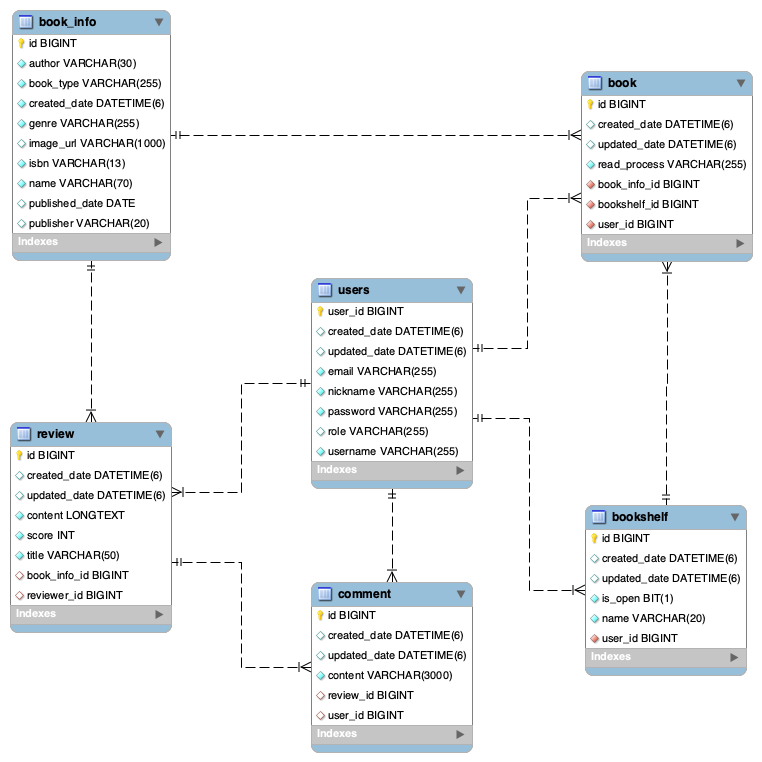

# Book Club

북클럽은 책을 읽기 쉽게 만들어주는 독서 모임 서비스입니다.\
다른 사람의 리뷰를 통해 관심있는 책을 쉽게 찾아 보고, 리뷰를 직접 작성해서 자신이 읽은 책을 추천해보세요.\
서로 영향을 주고 받으면서 즐겁고 의미있게 책 읽는 습관을 들일 수 있어요.

## 기술 스택

- Java 11
- Spring Boot 2.7.7
- Spring Data Jpa
- Spring Security
- QueryDSL
- H2
- Lombok
- JUnit 5

## 지원 기능

- 회원 등록, 정보 조회 및 수정
- 책 정보 등록 및 조회
- 책장 생성, 조회, 수정, 삭제
- 책 생성, 조회, 수정, 삭제
- 리뷰 등록, 조회, 수정, 삭제
- 댓글 등록, 조회, 수정, 삭제
- JWT 기반 인증 처리
- Service, Web 테스트

## 로컬에서 프로젝트 실행하기

```
git clone https://github.com/eunhasoo/book-club.git
cd book-club
./gradlew build
./gradlew run
```

## ERD


